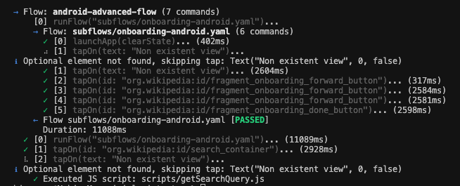

# 🚀 Lumi Tester Studio

A monorepo for a comprehensive mobile and web automation testing suite, featuring a powerful CLI tool and a professional Desktop IDE.



## 📦 Components

### 1. **lumi-tester** - CLI Testing Tool
A high-performance command-line tool written in Rust for automating tests across mobile (Android, iOS) and web platforms.

**Key Features:**
- 📝 **YAML DSL**: Define test cases using simple YAML files—no coding required.
- 📍 **Mock Location**: Simulate GPS coordinates using GPX, KML, or JSON files.
- 🎨 **Visual Assertion**: Ensure UI consistency with color and pixel-perfect assertions.
- 📹 **Recording & Screenshots**: Automatically capture images and videos of test execution.
- 🛠️ **Parallel Execution**: Run tests concurrently on multiple devices to save time.

**Supported Platforms:**
- **Android**: ADB, UiAutomator
- **iOS**: IDB (Simulators & Devices), XCUITest
- **Web**: Playwright (Chrome, Firefox, WebKit)

For more details, see [lumi-tester/README.md](lumi-tester/README.md).

---

### 2. **lumi-tester-studio** - Desktop IDE
A professional Desktop IDE built with Tauri, React, and TypeScript, designed for effortless test authoring and management.

**Key Features:**
- ✨ **Monaco Editor**: Intelligent autocomplete and syntax highlighting for YAML commands.
- 📁 **VSCode-like Management**: Intuitive file explorer with drag-and-drop and context menus.
- 🎯 **Device Selection**: Easily switch between platforms and devices for multi-platform testing.
- ⚡ **Real-time Execution**: Visualize test status and progress live.
- 📊 **Analytics Dashboard**: Integrated charts and reports for test results.
- 💾 **Efficiency**: Auto-save features with dirty indicators and familiar keyboard shortcuts (Cmd+S, Ctrl+Enter).

For more details, see [lumi-tester-studio/README.md](lumi-tester-studio/README.md).

---

### 3. **nexus-api** - API Service
The backend API service powering the test automation platform.

For more details, see [nexus-api/README.md](nexus-api/README.md).

## 🚀 Installation

### Lumi Tester Studio (Desktop App)

Download the latest installers from the [Releases](https://github.com/Nghi-NV/nl-tester/releases) page:

- **Windows**: `lumi-tester-studio-setup.exe`
- **macOS (Apple Silicon)**: `lumi-tester-studio-apple-silicon.dmg`
- **macOS (Intel)**: `lumi-tester-studio-intel.dmg`
- **Linux**: `lumi-tester-studio.AppImage`

### Lumi Tester (CLI Tool)

Download from the [lumi-tester Releases](https://github.com/Nghi-NV/nl-tester/releases):

- **Windows**: `lumi-tester-setup.exe`
- **macOS**: `lumi-tester-apple-silicon.pkg` or `lumi-tester-intel.pkg`

## 🛠️ Development

### Prerequisites
- **Node.js**: 20 or higher
- **Rust**: Stable toolchain
- **Package Manager**: Yarn or npm

### Building from Source

```bash
# Clone the repository
git clone https://github.com/Nghi-NV/nl-tester.git
cd nl-tester

# Build Lumi Tester Studio (Desktop IDE)
cd lumi-tester-studio
yarn install
yarn tauri dev  # Launch in development mode
yarn tauri build  # Build for production
```

### Building the CLI Tool

```bash
cd lumi-tester
cargo build --release
```

## 📚 Documentation

- [Lumi Tester Documentation](lumi-tester/docs/)
- [CI/CD Integration Guide](lumi-tester-studio/docs/CICD_GUIDE.md)
- [Writing Tests Guide](lumi-tester/docs/writing_tests.md)
- [Commands Reference](lumi-tester/docs/commands.md)

## 🔄 Release Workflow

The project uses an automated workflow to build and release upon pushing a new tag:

```bash
# Create a new tag
git tag v1.0.0

# Push the tag to trigger the workflow
git push origin v1.0.0
```

The workflow automatically:
- Builds the application for Windows, macOS (ARM64 & Intel), and Linux.
- Creates a GitHub Release with the compiled binaries.
- Uploads build artifacts.

For details, see [.github/workflows/release.yml](.github/workflows/release.yml).

## 📝 License

This project is licensed under the [MIT License](LICENSE) (or specify your license).

## 🤝 Contributing

Contributions are welcome! Please read our [Contributing Guide](CONTRIBUTING.md) to get started.

---

**Version**: 0.1.0  
**Repository**: [https://github.com/Nghi-NV/nl-tester](https://github.com/Nghi-NV/nl-tester)

