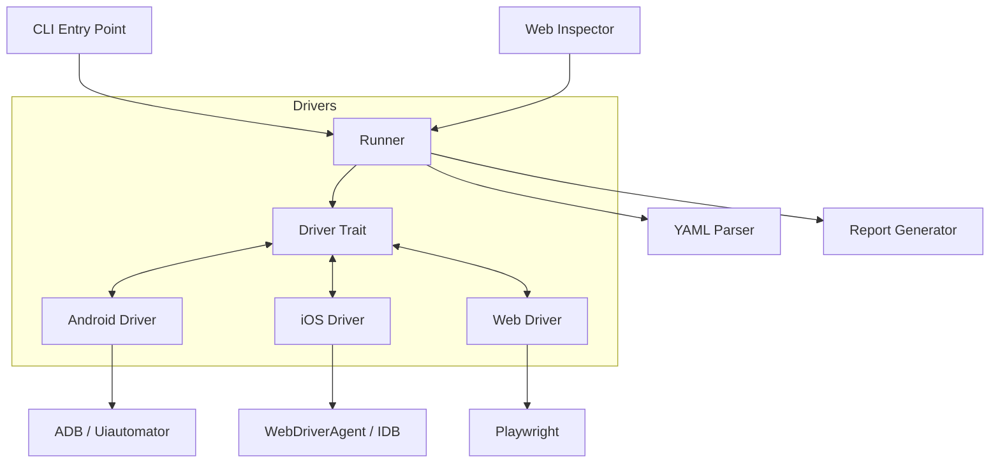

# Kiến trúc Hệ thống

## Tổng quan

Lumi Tester được xây dựng bằng ngôn ngữ **Rust** để đảm bảo hiệu năng và độ tin cậy. Hệ thống tuân theo kiến trúc module hóa, trong đó **Runner** thực thi các lệnh thông qua một **Driver Trait** thống nhất, không phụ thuộc vào nền tảng bên dưới.

## Các thành phần cốt lõi

### 1. Runner (`src/runner`)
Trái tim của ứng dụng. Nó duy trì trạng thái của test (state), xử lý nội suy biến (variable interpolation), và thực thi vòng lặp các bước test.

### 2. Parser (`src/parser`)
Chịu trách nhiệm chuyển đổi cấu hình YAML thân thiện với người dùng thành các cấu trúc lệnh có thể thực thi. Nó cũng xử lý việc parse các định dạng dữ liệu ngoài như GPX và CSV.

### 3. Drivers (`src/driver`)
Cầu nối giữa Lumi Tester và thiết bị vật lý/ảo.
- **Traits**: Định nghĩa "hợp đồng" (`tap`, `swipe`, `is_visible`) để đảm bảo API nhất quán giữa các nền tảng.
- **Android**: Sử dụng phương pháp lai giữa ADB (cho lệnh shell/input) và Uiautomator (để query UI XML).
- **iOS**: Giao tiếp với WebDriverAgent (WDA) cho tương tác UI hoặc `idb` để quản lý hệ thống.
- **Web**: Wrap các binding của Playwright để điều khiển trình duyệt.

### 4. Inspector (`src/inspector`)
Một web server độc lập cung cấp cái nhìn thời gian thực về màn hình thiết bị (mirror), kiểm tra phân cấp UI (hierarchy inspector), và ghi lại thao tác test (recorder). Giao diện frontend nằm trong `src/inspector/ui`.

### 5. Report (`src/report`)
Tự động tạo báo cáo test định dạng HTML và JSON, bao gồm ảnh chụp màn hình lúc lỗi và phân tích nguyên nhân.
