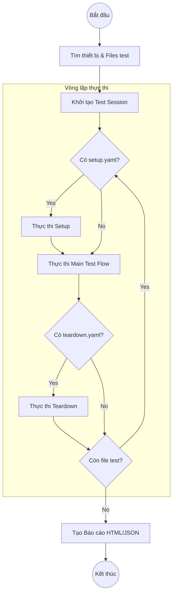
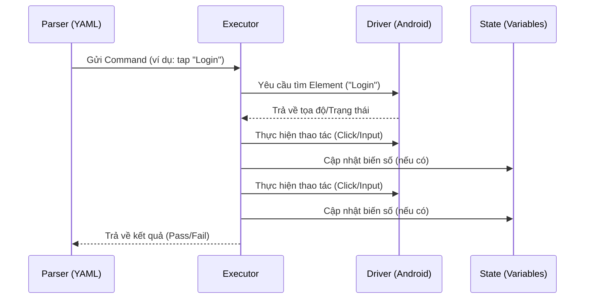

# 🔄 Cấu trúc và Luồng Test Flow

Tài liệu này giải thích cách `lumi-tester` tổ chức và thực thi các kịch bản test.

## 🏗️ Cấu trúc một Test Suite

Một kịch bản test có thể bao gồm 3 phần chính: **Setup**, **Main Flow**, và **Teardown**.

## 📋 Chi tiết các thành phần

### 1. Setup (`setup.yaml`)
Được chạy **trước mỗi file test**. Thường dùng để:
- Mở ứng dụng.
- Login (nếu cần cho mọi test).
- Cấp quyền (permissions).

### 2. Main Test Flow
Các file YAML chứa kịch bản test nghiệp vụ cụ thể.
- Ví dụ: `login_test.yaml`, `add_to_cart.yaml`.

### 3. Teardown (`teardown.yaml`)
Được chạy **sau mỗi file test** (ngay cả khi test thất bại). Dùng để:
- Đóng ứng dụng.
- Dọn dẹp dữ liệu test.
- Ngắt giả lập GPS (`stopMockLocation`).

## 🚀 Luồng xử lý Command

Mỗi dòng trong YAML được chuyển thành một Command. Dưới đây là luồng xử lý bên trong của một lệnh:

> **Lưu ý với iOS**: Luồng xử lý tương tự, nhưng sử dụng `idb` để tương tác với Simulator/Device. Một số lệnh như `eraseText` sẽ có hành vi khác (triple-tap + replace) để đảm bảo độ tin cậy.

## 🛠️ Xử lý khi Test Thất Bại

Khi một lệnh thất bại, `lumi-tester` thực hiện các bước sau để hỗ trợ debug:

1.  **Chụp ảnh màn hình lỗi**: Tên file có tiền tố `fail_`.
2.  **Dump UI Hierarchy**: Lưu cấu trúc XML của màn hình lúc lỗi.
3.  **Dump Logs**: Lấy logcat gần nhất từ thiết bị.
4.  **Teardown**: Vẫn thực thi phần teardown để trả thiết bị về trạng thái sạch.

---

## 💡 Mẹo cho Tester

- **Tính độc lập**: Mỗi file test nên độc lập, không phụ thuộc vào kết quả của file trước.
- **Dùng Sub-flows**: Có thể dùng lệnh `runFlow` để gọi các file YAML khác như một hàm, giúp tái sử dụng code.
