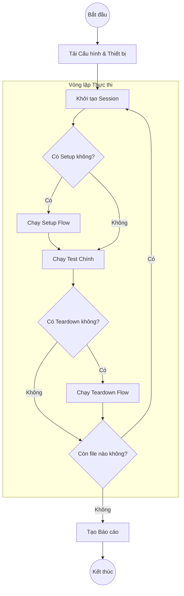

# Luồng thực thi Test (Test Execution Flow)

Tài liệu này giải thích chi tiết cách Lumi Tester điều phối một phiên kiểm thử, từ việc tải cấu hình đến khi tạo báo cáo.

## Vòng đời cấp cao (Lifecycle)

Quá trình thực thi tuân theo một vòng đời nghiêm ngặt để đảm bảo tính nhất quán và cô lập giữa các bài test.

### Các thành phần của Flow
- **Setup (`setup.yaml`)**: Chạy **trước** mỗi file test. Lý tưởng để mở app, đăng nhập, hoặc reset trạng thái.
- **Main Flow**: Kịch bản test nghiệp vụ chính.
- **Teardown (`teardown.yaml`)**: Chạy **sau** mỗi file test, bất kể thành công hay thất bại. Dùng để đóng app hoặc xóa dữ liệu test.

## Quy trình xử lý lệnh nội bộ

Khi một lệnh (ví dụ: `tap: "Login"`) được thực thi, nó đi qua đường ống (pipeline) sau:

1.  **Parsing**: Dòng YAML được chuyển đổi thành cấu trúc `Command` trong môi trường Rust.
2.  **Resolution**: Các biến (`${VAR}`) được giải quyết (thay thế) từ state hiện tại.
3.  **Driver Dispatch**: Runner gọi phương thức trait tương ứng của driver (ví dụ: `driver.tap()`).
4.  **Chiến lược Selector**:
    - Driver lấy cây phân cấp UI (Hierarchy) mới nhất.
    - Nếu selector cụ thể (ID, XPath) được cung cấp, nó tìm kiếm trực tiếp.
    - Nếu chỉ có chuỗi văn bản ("Login"), nó dùng cơ chế **Smart Selector** để tìm element khớp với Text, Content Description, hoặc Resource ID (có chấm điểm độ phù hợp).
5.  **Action**: Driver thực hiện hành động vật lý (gửi sự kiện cảm ứng, phím bấm).
6.  **Verification**: Đối với các lệnh assertion (.e.g `see`, `assertVisible`), driver sẽ xác minh trạng thái màn hình so với kỳ vọng.

## Xử lý lỗi (Failure Handling)

Nếu một bước gặp lỗi trong quá trình chạy:
1.  **Chụp màn hình**: Một ảnh screenshot lỗi (`fail_<testname>.png`) được chụp ngay lập tức.
2.  **Dump State**: Lưu lại UI Hierarchy (XML/JSON) và Log thiết bị (Logcat/Syslog) tại thời điểm lỗi.
3.  **Teardown**: Flow Teardown vẫn được kích hoạt để đảm bảo thiết bị sạch sẽ cho bài test tiếp theo.
4.  **Reporting**: Lỗi được ghi nhận vào báo cáo HTML/JSON cùng với các file đính kèm (ảnh, log).
