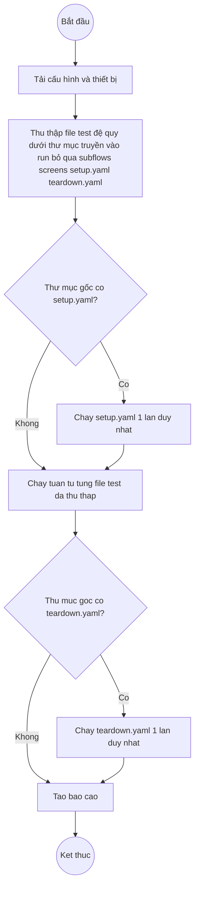

# Luồng thực thi Test (Test Execution Flow)

Tài liệu này giải thích chi tiết cách Lumi Tester điều phối một phiên kiểm thử, từ việc tải cấu hình đến khi tạo báo cáo.

## Vòng đời cấp cao (Lifecycle)

Quá trình thực thi tuân theo một vòng đời nghiêm ngặt để đảm bảo tính nhất quán và cô lập giữa các bài test.


```mermaid
graph TD
    Start(("Bắt đầu")) --> LoadConfig["Tải cấu hình và thiết bị"]
    LoadConfig --> Collect["Thu thập file test đệ quy dưới thư mục truyền vào run bỏ qua subflows screens setup.yaml teardown.yaml"]
    Collect --> HasSetup{"Thư mục gốc co setup.yaml?"}
    HasSetup -- "Co" --> RunSetup["Chay setup.yaml 1 lan duy nhat"]
    HasSetup -- "Khong" --> RunFiles
    RunSetup --> RunFiles["Chay tuan tu tung file test da thu thap"]
    RunFiles --> HasTeardown{"Thu muc goc co teardown.yaml?"}
    HasTeardown -- "Co" --> RunTeardown["Chay teardown.yaml 1 lan duy nhat"]
    HasTeardown -- "Khong" --> Report["Tao bao cao"]
    RunTeardown --> Report
    Report --> End(("Ket thuc"))
```

### Các thành phần của Flow

- **Setup (`setup.yaml`)**: Chạy **1 lần duy nhất, trước toàn bộ các file test chính** đã được thu thập trong lần chạy đó - **không phải trước mỗi file**. Chỉ được nhận diện khi nằm đúng ở thư mục truyền trực tiếp vào `run` (không tự áp dụng cho thư mục con lồng bên trong, dù `run` vẫn chạy hết file yaml trong các thư mục con đó). Lý tưởng để mở app, đăng nhập, hoặc reset trạng thái dùng chung cho cả nhóm test.
- **Main Flow**: Từng file test nghiệp vụ chính, chạy tuần tự.
- **Teardown (`teardown.yaml`)**: Chạy **1 lần duy nhất, sau toàn bộ các file test chính**, bất kể có file nào thất bại hay không - cùng phạm vi thư mục như Setup ở trên. Dùng để đóng app hoặc xóa dữ liệu test dùng chung.

Ví dụ tối thiểu cho `setup.yaml`/`teardown.yaml` đặt cạnh nhau trong cùng thư mục:

```text
tests/login_suite/
├── setup.yaml
├── teardown.yaml
├── 001_login_success.yaml
└── 002_login_wrong_password.yaml
```

`tests/login_suite/setup.yaml` (mở app 1 lần trước cả 2 file test):

```yaml
platform: android
appId: com.example.app
---
- launchApp:
    clearState: true
- waitUntilVisible:
    accessibilityId: "Login"
    timeout: 15000
```

`tests/login_suite/teardown.yaml` (đóng app 1 lần sau cả 2 file test):

```yaml
platform: android
appId: com.example.app
---
- stopApp
```

Chạy cả nhóm để 2 hook này thực sự được áp dụng (chạy 1 file lẻ sẽ bỏ qua cả 2):

```bash
lumi-tester run tests/login_suite --platform android --report --snapshot
```

## Quy trình xử lý lệnh nội bộ

Khi một lệnh (ví dụ: `tap: "Login"`) được thực thi, nó đi qua đường ống (pipeline) sau:

1.  **Parsing**: Dòng YAML được chuyển đổi thành cấu trúc `Command` trong môi trường Rust.
2.  **Resolution**: Các biến (`${VAR}`) được giải quyết (thay thế) từ state hiện tại.
3.  **Driver Dispatch**: Runner gọi phương thức trait tương ứng của driver (ví dụ: `driver.tap()`).
4.  **Chiến lược Selector**:
    - Driver lấy cây phân cấp UI (Hierarchy) mới nhất.
    - Nếu selector cụ thể (ID, XPath) được cung cấp, nó tìm kiếm trực tiếp.
    - Nếu chỉ có chuỗi văn bản ("Login"), nó dùng cơ chế **Smart Selector** để tìm element khớp với Text, Content Description, hoặc Resource ID (có chấm điểm độ phù hợp).
5.  **Action**: Driver thực hiện hành động vật lý (gửi sự kiện cảm ứng, phím bấm).
6.  **Verification**: Đối với các lệnh assertion (.e.g `see`, `assertVisible`), driver sẽ xác minh trạng thái màn hình so với kỳ vọng.

## Xử lý lỗi (Failure Handling)

Nếu một bước gặp lỗi trong quá trình chạy:
1.  **Chụp màn hình**: Một ảnh screenshot lỗi (`fail_<testname>.png`) được chụp ngay lập tức.
2.  **Dump State**: Lưu lại UI Hierarchy (XML/JSON) và Log thiết bị (Logcat/Syslog) tại thời điểm lỗi.
3.  **Teardown**: Flow Teardown vẫn được kích hoạt để đảm bảo thiết bị sạch sẽ cho bài test tiếp theo.
4.  **Reporting**: Lỗi được ghi nhận vào báo cáo HTML/JSON cùng với các file đính kèm (ảnh, log).
